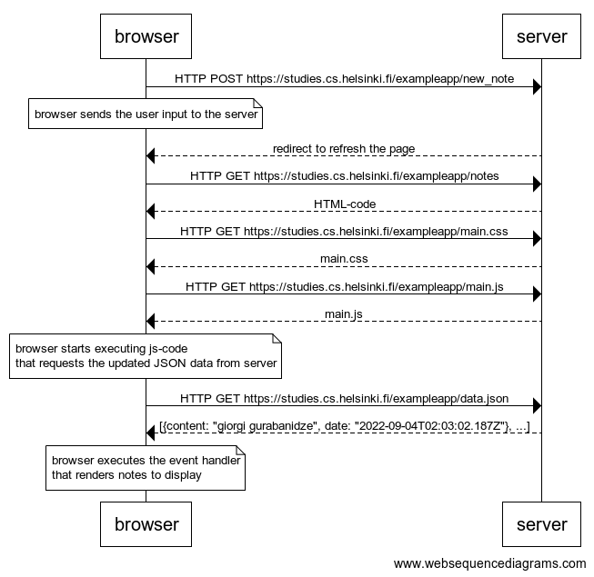

# part0
## 0.4: New note



```text
browser->server: HTTP POST https://studies.cs.helsinki.fi/exampleapp/new_note

note over browser:
browser sends the user input to the server
end note

server-->browser: redirect to refresh the page
browser->server: HTTP GET https://studies.cs.helsinki.fi/exampleapp/notes
server-->browser: HTML-code
browser->server: HTTP GET https://studies.cs.helsinki.fi/exampleapp/main.css
server-->browser: main.css
browser->server: HTTP GET https://studies.cs.helsinki.fi/exampleapp/main.js
server-->browser: main.js

note over browser:
browser starts executing js-code
that requests the updated JSON data from server 
end note

browser->server: HTTP GET https://studies.cs.helsinki.fi/exampleapp/data.json
server-->browser: [{content: "giorgi gurabanidze", date: "2022-09-04T02:03:02.187Z"}, ...]

note over browser:
browser executes the event handler
that renders notes to display
end note
```

## 0.5: Single page app


```text
browser->server: HTTP GET https://studies.cs.helsinki.fi/exampleapp/spa
server-->browser: HTML-code
browser->server: HTTP GET https://studies.cs.helsinki.fi/exampleapp/main.css
server-->browser: main.css
browser->server: HTTP GET https://studies.cs.helsinki.fi/exampleapp/spa.js
server-->browser: spa.js

note over browser:
browser starts executing js-code
that requests JSON data from server 
end note

browser->server: HTTP GET https://studies.cs.helsinki.fi/exampleapp/data.json
server-->browser: [{content: "ioaj oa", date: "2022-09-04T03:01:12.167Z"}, ...]

note over browser:
browser executes the event handler
that renders notes to display
end note
```

## 0.6: New note


```text
note over browser:
browser updates the list by appending the newly added note
end note

browser->server: HTTP POST https://studies.cs.helsinki.fi/exampleapp/new_note_spa
server-->browser: {"message":"note created"}
```